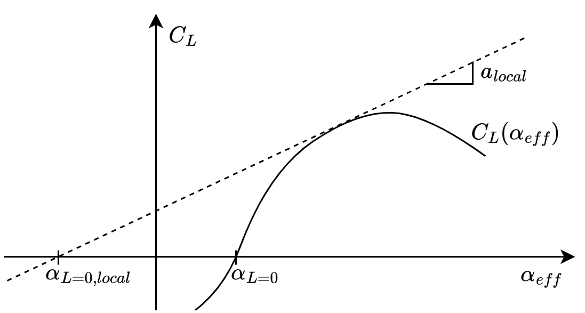

# Lifting Line Theory (LLT) — Extended Nonlinear Full-Span Implementation

## Introduction
This project implements in `AVONI_LLT.py` an extended version of Prandtl’s Lifting Line Theory (LLT), originally inspired by the code developed by **Nyaga:** *https://github.com/geoffreynyaga/lifting-line-theory*. 

The original Nyaga's code enabled the simulation of LLT for linearly tapered, linearly twisted wings using a single airfoil section, with user-defined wing setting angles and linear lift-curve slopes $\frac{dC_L}{d\alpha}$. The code only modeled half wing, supposing left/right symmetric wing behavior.

The hereby presented updated procedure allows LLT computations with the assumptions of Nyaga's code, but extended to any chord distribution $c(y)$, any twist distribution $t(y)$, and allowing user-defined $C_L(\alpha_{eff})$ airfoil laws. Moreover, the code was extended for full wing lift distribution, as to model asymmetric behavior if needed.

For more details on Lifting Line Theory and on the nomenclature used in current code, see Anderson, J. D., *Fundamentals of Aerodynamics* (6th ed.), McGraw-Hill Education, 2017.

## Lift Line Theory Equations

The code solves iteratively Eq. 2 and Eq. 3. Those account for the generalized fundamental equation of Prandtl's LLT in Fourier coefficients, expressed in Eq. 1. 
Along with the resolution of Eq. 2 and Eq. 3, the code also solves Eq. 4 as local lift coefficient criteria. This allows user-defined $C_L(\alpha_{eff})$ profiles. While not accounting for large incidence angles ($\tan^{-1}(\alpha)\approx\alpha$) the code can be used to attempt solutions in stalled configurations.

$$
\alpha(\theta_f) = \frac{4b}{a(\theta_f) c(\theta_f)}\sum^NA_n\sin(n\theta_f)+\alpha_{L=0}(\theta_f)+\sum^NnA_n\frac{\sin n\theta_f}{\sin\theta_f} \tag{1}
$$

$$
X_n = n\sin(n\theta_f)\left[1+\frac{c(\theta_f)a_{local}(\theta_f)}{4b}\cdot\frac{n}{\sin(\theta_f)}\right]\tag{2}
$$

$$
\left[X_1,X_2,\cdots,X_N\right]\left[A_1,A_2,\cdots,A_N\right]^T = \frac{c(\theta_f)a_{local}(\theta_f)}{4b}\cdot\left( \alpha\left(\theta_f\right)-\alpha_{L=0,local}\left(\theta_f\right)\right)\tag{3}
$$
$$
C_{L,\Gamma}(\theta_f) = C_{L,\alpha_{eff}}(\theta_f)\tag{4}
$$

The code proceeds as follows:

1. All wing quantities (span, chord distribution, $C_L(\alpha)$ distribution, twist distribution, airfoil zero lift angle, wing setting angle) are declared
2. The wing is divided in $N+1$ segments, with $N$ inside points and two wingtip points
3. An initial effective angle distribution $\alpha_{eff}$ is assumed (starts as equal to $\alpha$ distribution)
4. Coherent with previous step ($\alpha_i=0$), an initial zero circulation distribution is assumed
5. For each iteration, until convergence:
5.1  using $a_{local}$, the left hand side (LHS) and right hand side ($[X]$ group) of Eq. 1 are computed. This is done simultaneously for all $\theta_f$ positions: $[X]$ and LHS are hence respectively a square matrix and a vector
5.2 $[X]$ is inverted to obtain all $A_i$ terms
5.3. Using the $A_i$ terms, local circulation $\Gamma$ and local effective angle of attack $\alpha_{eff}$ are computed
5.4. Using $\Gamma$ and $\alpha_{eff}$ distributions, the $C_{L,\Gamma}$ and $C_{L,\alpha_{eff}}$ distributions are computed
5.5. Comparison according to Eq. 2 defines if convergence has been reached or not

6. Spanwise circulation and 3D wing lift coefficient are returned to the user

Within Eq. 1 and Eq. 2, *local* aerodynamic terms are defined. As illustrated in the figure below, these values differ from the airfoil-defined quantities when the lift curve \( C_L(\alpha_{\text{eff}}) \) is nonlinear. The *local* terms represent an equivalent linearized lift-curve behavior used by the LLT solver during each iteration.

<figure>
  
  <figcaption><strong>Figure 1:</strong> Nonlinear airfoil lift curve, along with local terms used in the numerical LLT method.</figcaption>
</figure>
