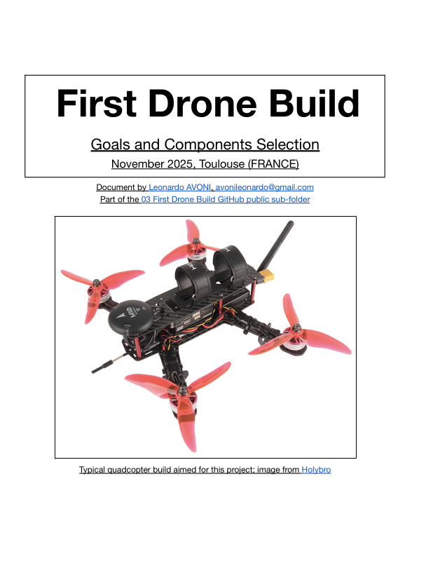
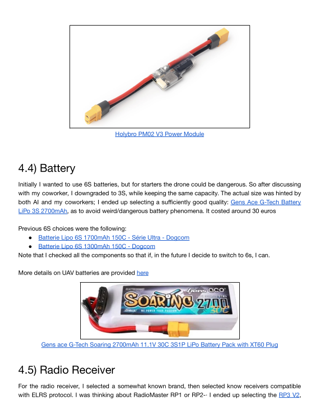
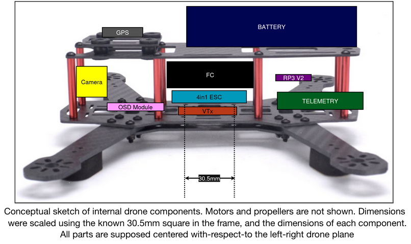

# First Drone Build 
## Why this project?

I’m Leonardo Avoni, 25 y.o. 3rd-year PhD student (ISAE-SUPAERO / ENAC, Toulouse) in flexible fixed-wing aircraft design & control.  
My background is purely mechanical/aerospace → I had zero practical experience in drone electronics, flight controllers, ESC calibration, etc.

→ This personal project is my way to **get my hands dirty** with real UAV hardware & software while staying on a reasonable budget.

## Available Reports

To specify the choices I made, the full component list, all electrical connections and all sort of similar things, I wrote the following documents:

And here's a few pictures to give you desire to read those pages ;)

> **Full detailed report (70+ pages)** → [01_Documents/01_First_Drone_Build.pdf](01_Documents/01_First_Drone_Build.pdf)  
> **Wiring diagram (editable SVG)** → [02_First_Drone_Build_Wiring_Scheme.svg](02_First_Drone_Build_Wiring_Scheme.svg)

## Goals (in order of priority)

1. Understand component selection (compatibility, specs, pitfalls)
2. Build a flyable quadcopter without burning the house down
3. Set up a ground station (QGroundControl)
4. Fly safely in manual mode (acro / stabilized)
5. Calibrate everything properly
6. Achieve basic autonomous missions (PX4 + QGroundControl)

→ **Not** chasing maximum flight time or racing performance or any design optimization – just something that reliably flies and teaches me the full stack.

## Baseline Choices
To allow easier law fulfillment and also have a less dangerous drone, I chose to build a QAV250 platform, aka a 250mm motor-to-motor diagonal quadcopter. Moreover, this project uses PX4 + Pixhawk 6C Mini. The reasons for this choice are specified in the above documentation. 

## Current cost
The cost includes shipping and taxes (Shipping to Toulouse, France)

| When |Category                              | Amount spent (€) |
|--|-------------------------------------|------------------|
| 11/2025|First drone (e.g. ESC) and non-drone (e.g. Battery Charger) components | 540              |

## Current status (November 2025)

- Full component list with exact AliExpress/Amazon links
- Detailed compatibility checks (voltages, connectors, mounting holes)
- Complete wiring diagram (SVG)
- Step-by-step assembly notes & pitfalls
- Simplified Drone conceptual CAD

## Next steps (once parts arrive)

1. Mechanical assembly & soldering
2. Drone Software

#### 

