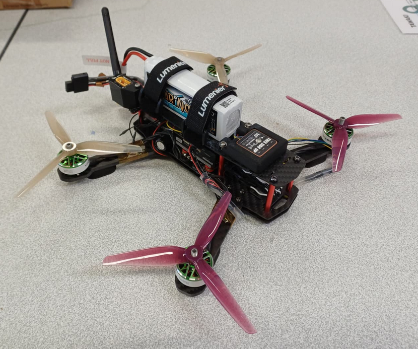
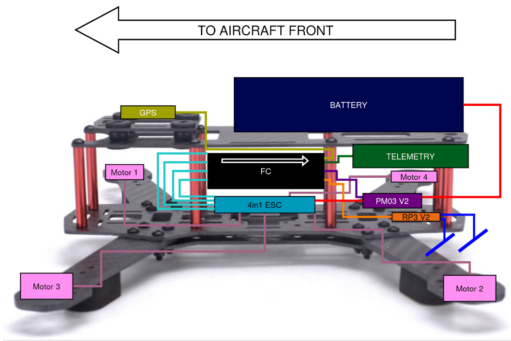
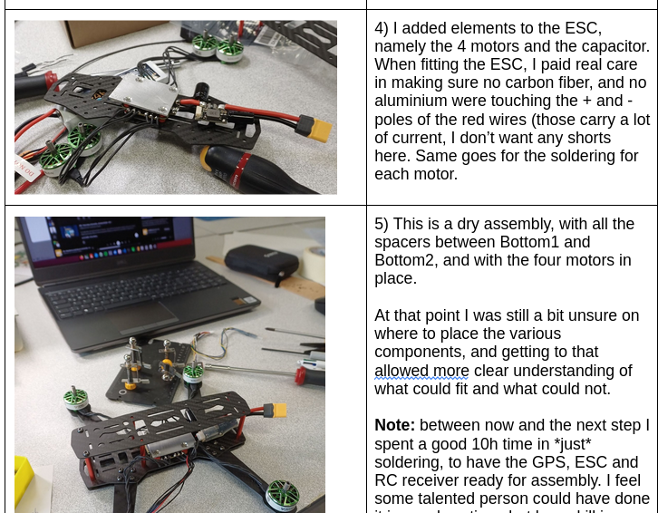
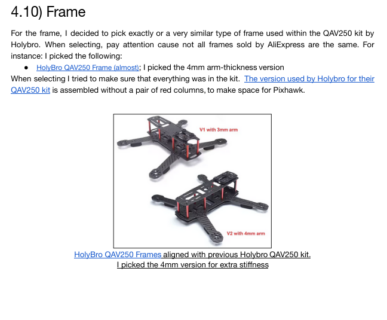
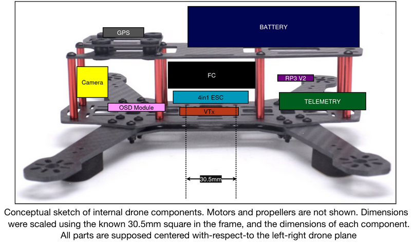
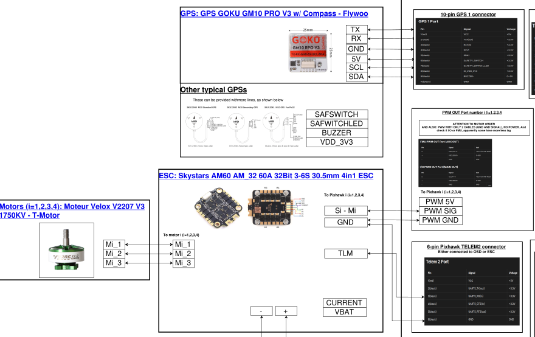

# First Drone Build 

  

  

## Why this project?

I'm Leonardo Avoni — 25 y.o., 3rd-year PhD student at ISAE-SUPAERO / ENAC (Toulouse), researching flexible fixed-wing aircraft design & control. My background is purely mechanical and aerospace, which means I had zero hands-on experience with drone electronics, flight controllers, or ESC calibration when I started this. This project is my way of fixing that — getting my hands dirty with real UAV hardware and software, on a reasonable budget, with proper documentation along the way.
The platform of choice is a QAV250 — a compact 250mm motor-to-motor quadrotor, small enough to stay safe and affordable, capable enough to support some basic autonomous flight features.

>⚠️ A serious note before anything else: always check and comply with your local drone regulations before flying. Rules vary significantly by country, area, and aircraft weight — it is entirely your responsibility to know and follow them. I take no responsibility for your build, your flights, or any consequences arising from either.

## Reports & Documentation

Three documents are available, where I detail my latest advancements:

- 📄 **Component Selection & Goals** → [01_QAV250_GoalAndSelection.pdf](01_Documents/01_QAV250_GoalAndSelection.pdf)
- 🗺️ **Wiring Diagram** (vectorial) → [02_First_Drone_Build_Wiring_Scheme.pdf](01_Documents/02_First_Drone_Build_Wiring_Scheme.pdf)
- 🔧 **Hardware Build Report** → [03_QAV250_HardwareBuild.pdf](01_Documents/03_QAV250_HardwareBuild.pdf)

And here's some peeking of what's inside, have fun reading!

  
  
  
    
  </a>

## Goals (in order of priority)

1. Understand component selection (compatibility, specs, pitfalls): **DONE!**
2. Build a flyable quadcopter without burning the house down
3. Set up a ground station (QGroundControl)
4. Fly safely in manual mode (acro / stabilized)
5. Calibrate everything properly
6. Achieve basic autonomous missions (PX4 + QGroundControl)

→ **Not** chasing maximum flight time or racing performance or any design optimization – just something that reliably flies and teaches me the full stack.

## Baseline Choices
To allow easier law fulfillment and also have a less dangerous drone, I chose to build a QAV250 platform, aka a 250mm motor-to-motor-diagonal quadcopter. Moreover, this project uses PX4 + Pixhawk 6C Mini. The reasons for this choice are specified in the above documentation. 

## Current cost
The cost includes shipping and taxes (Shipping to Toulouse, France)

| When |Category                              | Cumulated Amount Spent (€) |
|--|-------------------------------------|------------------|
| 11/2025|First drone (e.g. ESC) and non-drone (e.g. Battery Charger) components | 540              |
| 01/0206| Bought Additional GH1.25 10P pre-crimped cables | 548              |

## Current status (March 2026)

- Full component list with exact AliExpress/Amazon links: **DONE**
- Detailed compatibility checks (voltages, connectors, mounting holes) **DONE**
- Updated (Feb2026) wiring diagram (PDF) + Pinout details on the report **DONE**
- Started FPV Liftoff simulator with RC Controller **DONE**
- Step-by-step assembly notes & pitfalls **DONE**
- Simplified Drone conceptual CAD **DONE**
- Drone Assembly (Feb2026): **DONE**

## Next steps
1. Drone Software: calibration and flight (manual)
2. PX4-Gazebo-QGC flight simulation

#### 

